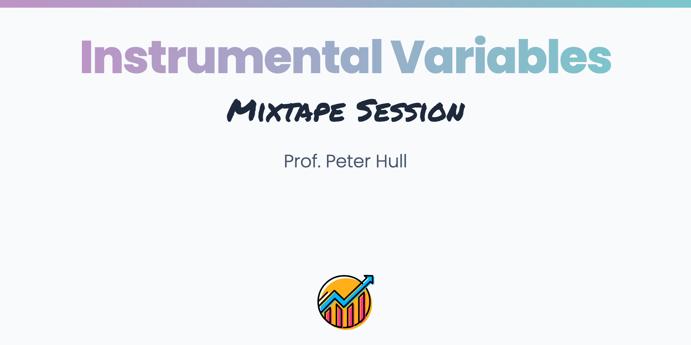

 
 

 

Instrumental variables (IV) is a powerful tool for leveraging external (“exogenous”) variation to estimate the causal effects of otherwise confounded (“endogenous”) variables. This one-day workshop will introduce the basics of IV through different practical examples, formalize the requirements of a valid and powerful IV, and discuss the mechanics of the two-stage least squares (2SLS) estimator. Special focus will be paid on interpreting linear IV under heterogeneous treatment effects and recent advances in judge leniency designs, shift-share IV, and more. The course will include substantial group programming exercises, where different IV techniques will be illustrated in real-world applications. 
 

  
 
 

<b>Introduction</b>
 

<b>About</b>

- Introduction

- Regression Review
  - Models vs. Estimands vs. Estimators
  - Regression Identification and Endogeneity

- Introduction to IV
  - Instrument Validity and Relevance
  - The 2SLS Estimator

<b>Slides</b>

<a href="https://raw.githubusercontent.com/Mixtape-Sessions/Instrumental-Variables/main/Slides/01-Introduction.pdf">Introduction</a>

<b>Readings</b>

<a href="https://raw.githubusercontent.com/Mixtape-Sessions/Instrumental-Variables/main/Readings/Lecture1/Angrist_1990.pdf">Angrist (1990)</a>

<a href="https://raw.githubusercontent.com/Mixtape-Sessions/Instrumental-Variables/main/Readings/Lecture1/MHE_IV_excerpt.pdf">Mostly Harmless Economics (excerpt)</a>

<a href="https://raw.githubusercontent.com/Mixtape-Sessions/Instrumental-Variables/main/Readings/Lecture1/PH1630_Chapter8_Notes.pdf">My Lecture Notes</a>

 

<b>Understanding IV</b>
 

<b>About</b>

- Where do (Good) Instruments Come From?
  - True Lotteries
  - Natural Experiments
  - Panel Data

- 2SLS Mechanics
  - Just-Identified IV
  - Overidentification

- Weak and Many IVs
  - Weak IV
  - Many IVs

<b>Slides</b>

<a href="https://raw.githubusercontent.com/Mixtape-Sessions/Instrumental-Variables/main/Slides/02-UnderstandingIV.pdf">Understanding IV</a>

<b>Readings</b>

<a href="https://raw.githubusercontent.com/Mixtape-Sessions/Instrumental-Variables/main/Readings/Lecture2/Angrist_Imbens_Krueger_1999.pdf">Angrist, Imbens, and Krueger (1999)</a>

<a href="https://raw.githubusercontent.com/Mixtape-Sessions/Instrumental-Variables/main/Readings/Lecture2/Angrist_Kureger_2001.pdf">Angrist and Kureger (2001)</a>

<a href="https://raw.githubusercontent.com/Mixtape-Sessions/Instrumental-Variables/main/Readings/Lecture2/Lee_Moreira_McCrary_Porter_2020.pdf">Lee, Moreira, McCrary, and Porter (2020)</a>

<a href="https://raw.githubusercontent.com/Mixtape-Sessions/Instrumental-Variables/main/Readings/Lecture2/Angrist_Kolesar_2022.pdf">Angrist and Kolesar (2022)</a>

<a href="https://raw.githubusercontent.com/Mixtape-Sessions/Instrumental-Variables/main/Readings/Lecture2/Bound_Jaeger_Baker_1995.pdf">Bound, Jaeger, and Baker (1995)</a>

<a href="https://raw.githubusercontent.com/Mixtape-Sessions/Instrumental-Variables/main/Readings/Lecture2/PH1630_Chapter9_Notes.pdf">My Lecture Notes</a>

<a href="https://raw.githubusercontent.com/Mixtape-Sessions/Instrumental-Variables/main/Readings/Lecture2/Angrist_Krueger_1991.pdf">Angrist and Krueger (1991)</a>

<a href="https://raw.githubusercontent.com/Mixtape-Sessions/Instrumental-Variables/main/Readings/Lecture2/Buckles_Hungerman_2013.pdf ">Buckles and Hungerman (2013)</a>

<a href="https://raw.githubusercontent.com/Mixtape-Sessions/Instrumental-Variables/main/Readings/Lecture2/Staiger_Stock_1997.pdf">Staiger and Stock (1997)</a>

<a href="https://raw.githubusercontent.com/Mixtape-Sessions/Instrumental-Variables/main/Readings/Lecture2/Angrist_Krueger_1992.pdf">Angrist and Krueger (1992)</a>

<a href="https://raw.githubusercontent.com/Mixtape-Sessions/Instrumental-Variables/main/Readings/Lecture2/Flores_Lagunes_2007.pdf">Flores and Lagunes (2007)</a>

<a href="https://raw.githubusercontent.com/Mixtape-Sessions/Instrumental-Variables/main/Readings/Lecture2/Stock_and_Yogo_2002.pdf">Stock and Yogo (2002)</a>

<a href="https://raw.githubusercontent.com/Mixtape-Sessions/Instrumental-Variables/main/Readings/Lecture2/Angrist_Krueger_1995.pdf">Angrist and Krueger (1995)</a>

<a href="https://raw.githubusercontent.com/Mixtape-Sessions/Instrumental-Variables/main/Readings/Lecture2/Hudson_Hull_Liebersohn_2017.pdf">Hudson, Hull, and Liebersohn (2017)</a>

<a href="https://raw.githubusercontent.com/Mixtape-Sessions/Instrumental-Variables/main/Readings/Lecture2/Abdulkadiroglu_Angrist_Hull_Pathak_2016.pdf">Abdulkadiroglu, Angrist, Hull, Pathak (2016)</a>

 

<b>Heterogeneous Effects</b>
 

<b>About</b>

- The LATE Theorem
  - Potential Outcomes Setup
  - Theorem and Extensions

- Characterizing Compliers
  - Outcomes
  - Covariates

- Marginal Treatment Effects
  - Continuous Instruments
  - Discrete Instruments

<b>Slides</b>

<a href="https://raw.githubusercontent.com/Mixtape-Sessions/Instrumental-Variables/main/Slides/03-HeterogeneousFX.pdf">Heterogeneous Effects</a>

<b>Readings</b>

<a href="https://raw.githubusercontent.com/Mixtape-Sessions/Instrumental-Variables/main/Readings/Lecture3/Abadie_2002.pdf">Abadie (2002)</a>

<a href="https://raw.githubusercontent.com/Mixtape-Sessions/Instrumental-Variables/main/Readings/Lecture3/Doyle_2007.pdf">Doyle (2007)</a>

<a href="https://raw.githubusercontent.com/Mixtape-Sessions/Instrumental-Variables/main/Readings/Lecture3/Abadie_2003.pdf">Abadie (2003)</a>

<a href="https://raw.githubusercontent.com/Mixtape-Sessions/Instrumental-Variables/main/Readings/Lecture3/Heckman_2000.pdf">Heckman (2000)</a>

<a href="https://raw.githubusercontent.com/Mixtape-Sessions/Instrumental-Variables/main/Readings/Lecture3/Abadie_Angrist_Imbens_2002.pdf">Abadie, Angrist, and Imbens (2002)</a>

<a href="https://raw.githubusercontent.com/Mixtape-Sessions/Instrumental-Variables/main/Readings/Lecture3/Heckman_Vytlicil_2005.pdf">Heckman and Vytlicil (2005)</a>

<a href="https://raw.githubusercontent.com/Mixtape-Sessions/Instrumental-Variables/main/Readings/Lecture3/Angrist_Graddy_Imbens_2000.pdf">Angrist, Graddy, and Imbens (2000)</a>

<a href="https://raw.githubusercontent.com/Mixtape-Sessions/Instrumental-Variables/main/Readings/Lecture3/Hull_2020.pdf">Hull (2020)</a>

<a href="https://raw.githubusercontent.com/Mixtape-Sessions/Instrumental-Variables/main/Readings/Lecture3/Angrist_Imbens_1994.pdf">Angrist and Imbens (1994)</a>

<a href="https://raw.githubusercontent.com/Mixtape-Sessions/Instrumental-Variables/main/Readings/Lecture3/Imbens_Rubin_1997.pdf">Imbens and Rubin (1997)</a>

<a href="https://raw.githubusercontent.com/Mixtape-Sessions/Instrumental-Variables/main/Readings/Lecture3/Angrist_Imbens_1995.pdf">Angrist and Imbens (1995)</a>

<a href="https://raw.githubusercontent.com/Mixtape-Sessions/Instrumental-Variables/main/Readings/Lecture3/Kitagawa_2015.pdf">Kitagawa (2015)</a>

<a href="https://raw.githubusercontent.com/Mixtape-Sessions/Instrumental-Variables/main/Readings/Lecture3/Angrist_Imbens_Rubin_1996.pdf">Angrist, Imbens, and Rubin (1996)</a>

<a href="https://raw.githubusercontent.com/Mixtape-Sessions/Instrumental-Variables/main/Readings/Lecture3/Kline_Walters_2019.pdf">Kline and Walters (2019)</a>

<a href="https://raw.githubusercontent.com/Mixtape-Sessions/Instrumental-Variables/main/Readings/Lecture3/Angrist_Pathak_Walters_2013.pdf">Angrist, Pathak, and Walters (2013)</a>

<a href="https://raw.githubusercontent.com/Mixtape-Sessions/Instrumental-Variables/main/Readings/Lecture3/Kowalski_2022.pdf">Kowalski (2022)</a>

<a href="https://raw.githubusercontent.com/Mixtape-Sessions/Instrumental-Variables/main/Readings/Lecture3/Arnold_Dobbie_Hull_2021.pdf">Arnold, Dobbie, and Hull (2021)</a>

<a href="https://raw.githubusercontent.com/Mixtape-Sessions/Instrumental-Variables/main/Readings/Lecture3/Mogstad_Santos_Torgovitsky_2018.pdf">Mogstad, Santos, and Torgovitsky (2018)</a>

<a href="https://raw.githubusercontent.com/Mixtape-Sessions/Instrumental-Variables/main/Readings/Lecture3/Behaghel_Crepon_Gurgand_2013.pdf">Behaghel, Crepon, and Gurgand (2013)</a>

<a href="https://raw.githubusercontent.com/Mixtape-Sessions/Instrumental-Variables/main/Readings/Lecture3/Mogstad_Torgovitsky_Walters_2021.pdf">Mogstad, Torgovitsky, and Walters (2021)</a>

<a href="https://raw.githubusercontent.com/Mixtape-Sessions/Instrumental-Variables/main/Readings/Lecture3/Blandhol_Bonney_Mogstad_Torgovitsky_2022.pdf">Blandhol, Bonney, Mogstad, and Torgovitsky (2022)</a>

<a href="https://raw.githubusercontent.com/Mixtape-Sessions/Instrumental-Variables/main/Readings/Lecture3/Sloczynski_2020.pdf">Sloczynski (2020)</a>

<a href="https://raw.githubusercontent.com/Mixtape-Sessions/Instrumental-Variables/main/Readings/Lecture3/Brinch_Mogstad_Wiswall_2017.pdf">Brinch, Mogstad, and Wiswall (2017)</a>

<a href="https://raw.githubusercontent.com/Mixtape-Sessions/Instrumental-Variables/main/Readings/Lecture3/Vytlacil_2002.pdf">Vytlacil (2002)</a>

 

<b>IV Frontiers</b>
 

<b>About</b>

- Judge/Examiner IV
  - Approach
  - Cautions

- Shift-Share IV
  - Approach
  - Cautions

- Other Frontiers
  - Diff-in-diff IV
  - Recentered IV

<b>Slides</b>

<a href="https://raw.githubusercontent.com/Mixtape-Sessions/Instrumental-Variables/main/Slides/04-TheFrontier.pdf">IV Frontiers</a>

<b>Readings</b>

<a href="https://raw.githubusercontent.com/Mixtape-Sessions/Instrumental-Variables/main/Readings/Lecture4/Adao_Kolesar_Morales_2019.pdf">Adao, Kolesar, and Morales (2019)</a>

<a href="https://raw.githubusercontent.com/Mixtape-Sessions/Instrumental-Variables/main/Readings/Lecture4/Evdokimov_and_Kolesar_2018.pdf">Evdokimov and Kolesar (2018)</a>

<a href="https://raw.githubusercontent.com/Mixtape-Sessions/Instrumental-Variables/main/Readings/Lecture4/Stevenson_2018.pdf">Stevenson (2018)</a>

<a href="https://raw.githubusercontent.com/Mixtape-Sessions/Instrumental-Variables/main/Readings/Lecture4/Borusyak_Hull_2021.pdf">Borusyak and Hull (2021)</a>

<a href="https://raw.githubusercontent.com/Mixtape-Sessions/Instrumental-Variables/main/Readings/Lecture4/Goldsmith-Pinkham_Sorkin_Swift_2020.pdf">Goldsmith-Pinkham, Sorkin, and Swift (2020)</a>

<a href="https://raw.githubusercontent.com/Mixtape-Sessions/Instrumental-Variables/main/Readings/Lecture4/Borusyak_Hull_Jaravel_2022.pdf">Borusyak, Hull, and Jaravel (2022)</a>

<a href="https://raw.githubusercontent.com/Mixtape-Sessions/Instrumental-Variables/main/Readings/Lecture4/Kolesar_2013.pdf">Kolesar (2013)</a>

 

<b>Conclusion</b>
 

<b>About</b>

This is a short lecture concluding the Mixtape Session. Thanks for coming!

<b>Slides</b>

<a href="https://raw.githubusercontent.com/Mixtape-Sessions/Instrumental-Variables/main/Slides/05-Conclusion.pdf">IV Frontiers</a>

 
